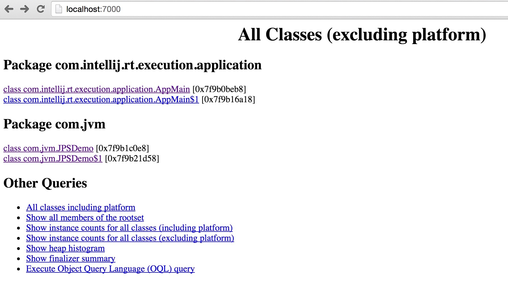

# JVM实战系列第1讲：JDK性能监控命令

JDK提供了一系列的命令工具来辅助监控JVM的运行状态，其中最常用的JDK监控命令有下面几个：

* jps命令：查看虚拟机进程
* jstat命令：查看JVM的GC情况
* jmap命令：导出JVM堆信息
* jstack命令：导出线程堆栈信息

更多命令可以查阅本文附带的[更多JDK性能命令]()。

## 查看虚拟机进程：jps 命令

jps 命令可以列出所有的 Java 进程。如果 jps 不加任何参数，可以列出 Java 程序的进程 ID 以及 Main 函数短名称，如下所示。

```
$ jps
33970
34072 Launcher
34073 SleepDemo
34027 RemoteMavenServer
34140 Jps
```

除此之外，还可以指定下面的参数自定义输出信息：

| 参数 | 含义 |
|:---:|:---:|
|-q|指定jps只输出进程ID|
|-m|输出传递给Java进程的参数|
|-l|输出主函数的完整路径|
|-v|显示传递给Java虚拟机的参数|

## 虚拟机统计信息：jstat 命令

jstat 用于观察 Java 堆信息的详细情况，其基本使用语法为：

```
jstat -<option> [-t] [-h<lines>] <vmid> [<interval>] [<count>]]
```

* option 可以由以下值构成：

| 参数 | 含义 |
|:---:|:---:|
|-class|监视类装载、卸载数量、总空间以及类装载所耗费的时间|
|-gc|监视Java堆状况，包括Eden区、两个Survivor区、老年代、永久代等的容量、已用空间、GC时间合计等信息|
|-gccapacity|监视内容与-gc基本相同，但输出主要关注Java堆各个区域使用到的最大、最小空间|
|-gcutil|监视内容与-gc基本相同，但输出主要关注已使用空间占总空间的百分比|
|-gccause|与-gcutil功能一样，但是会额外输出导致上一次GC产生的原因|
|-gcnew|监视新生代GC状况|
|-gcnewcapacity|监视内容与-gcnew基本相同，输出主要关注使用到的最大、最小空间|
|-gcold|监视老年代GC状况|
|-gcoldcapacity|监视内容与-gcold基本相同，输出主要关注使用到的最大、最小空间|
|-gcpermcapacity|输出永久代使用到的最大、最小空间|
|-compiler|输出JIT编译器编译过的方法、耗时信息|
|-printcompilation|输出已经被JIT编译的方法|

* -t 参数表示输出时间戳
* -h 参数表示在多少行后输出一个表头
* vmid 则是虚拟机的进程ID
* interval 和 count 表示输出间隔以及输出次数。

例如：我们用jstat命令来监视一个LVMID为2365的JVM进程。

```
$ jstat -gcutil 2365 
  S0     S1     E      O      P     YGC     YGCT    FGC    FGCT     GCT   
  0.00   0.00  12.05   0.00  14.17      0    0.000     0    0.000    0.000
```

其中每个选项的意义如下：

| 参数 | 含义 |
|:---:|:---:|
|S0、S1|表示Survivor0、Survivor1，还未使用。|
|E|表示Eden区使用了12.05%的空间。|
|O|表示老年代还未使用。|
|P|表示永久代使用了14.17%的空间|
|YUC、YGCT|表示从程序运行以来一共发生了0次Minor GC（YGC，Young GC），总共耗时0秒。|
|FGC、FGCT|表示从程序运行以来一共发生了0次Full GC（FGC，Full GC），总共耗时0秒。|

## 导出堆到文件：jmap 命令

jmap 是一个多功能命令，可以生成 Java 程序的 Dump 文件，也可以查看堆内对象实例的统计信息、查看 ClassLoader 的信息以及 finalizer 队列。

```
jmap [option] vmid
```

执行样例，使用 jmap 生成一个正在运行的 Eclipse 的 dump 快照文件的例子。例子中的2618是通过jps名称查询到的LVMID。

```
$ jmap -dump:format=b,file=Desktop/dump.bin 2618
Dumping heap to /Users/yurongchan/Desktop/dump.bin ...
Heap dump file created
```

## 查看线程堆栈：jstack 命令

jstack 命令用于导出 Java 应用程序的线程堆栈。

jstack命令格式：

```
jstack [option] vmid
```

使用下面的例子来测试jstack命令：

```
public class SleepDemo {
    public static void main(String[] args) {
        System.out.println("Enter main...");
        try {
            Thread.sleep(60 * 60 * 1000);
        } catch (InterruptedException e) {
            e.printStackTrace();
        }
    }
}
```

上面例子中让线程休眠了一个小时，之后利用`jstack`命令导出堆栈信息：

```
"main" #1 prio=5 os_prio=31 tid=0x00007f8bd8800800 nid=0x1103 waiting on condition [0x000070000e3c2000]
   java.lang.Thread.State: TIMED_WAITING (sleeping)
	at java.lang.Thread.sleep(Native Method)
	at com.chenshuyi.SleepDemo.main(SleepDemo.java:11)
   Locked ownable synchronizers:
	- None
```

从上面部分堆栈信息可以看出，SleepDemo类的线程状态为`TIMED_WAITING`，即正在休眠的状态。

## 更多JDK性能命令

|命令|作用|
|:---:|:---:|
|jps命令|查看虚拟机进程。|
|jstat命令|统计虚拟机信息。常用于查看虚拟机GC情况。|
|jinfo命令|查看Java应用程序的扩展参数。|
|jmap命令|导出堆到文件|
|jhat命令|JDK自带的堆分析工具|
|jstack命令|查看线程堆栈信息|
|jstatd命令|远程主机信息收集|
|jcmd命令|多功能命令行，jcmd 命令可以针对给定的 Java 虚拟机执行一条命令。|
|hprof命令|性能统计工具| 

### 堆分析工具：jhat 命令 

jhat 命令用于分析 Java 应用的对快照内存。Sun JDK 提供了 jhat 命令与 jmap 搭配使用，来分析 jmap 生成的堆转储快照。jhat 内置了一个微型的 HTTP/HTML 服务器，生成 dump 文件的分析结果后，可以在浏览器中查看。下面我们用 jhat 来分析上面生成的 dump.bin 文件：

```
$ jhat dump.bin 
Reading from dump.bin...
Dump file created Sun May 15 23:04:19 CST 2016
Snapshot read, resolving...
Resolving 13822 objects...
Chasing references, expect 2 dots..
Eliminating duplicate references..
Snapshot resolved.
Started HTTP server on port 7000
Server is ready.
```

之后在浏览器输入 http://localhost:7000 就可以看到分析结果，如下图所示：



不过一般情况下不用 jhat 命令来分析 dump 文件，主要有以下两个原因：一是一般不会再部署应用的服务器上分析 dump 文件，因为分析工作是一个耗时而且消耗硬件资源的过程。另一个原因是 jhat 的分析功能还比较简陋，比起后面介绍的 VisualVM 等工具还差得很多。

### 远程主机信息收集：jstatd 命令

jstad 命令用于收集远程主机信息。

日常使用较少，如感兴趣可以参考《实战Java虚拟机》一书。

### 多功能命令行：jcmd 命令

jcmd 命令可以针对给定的 Java 虚拟机执行一条命令。

日常使用较少，如感兴趣可以参考《实战Java虚拟机》一书。

### 性能统计工具：hprof 命令

日常使用较少，如感兴趣可以参考《实战Java虚拟机》一书。

### 查看虚拟机参数：jinfo 命令

jinfo 可以用来查看正在运行的 Java 应用程序的扩展参数，甚至支持在运行时，修改部分参数。它的基本语法是：

```
jinfo <option> <pid>
```

执行例子，查询 CMSInitiatingOccupancyFraction 参数值

```
$ jinfo -flag CMSInitiatingOccupancyFraction 2618
-XX:CMSInitiatingOccupancyFraction=-1
```