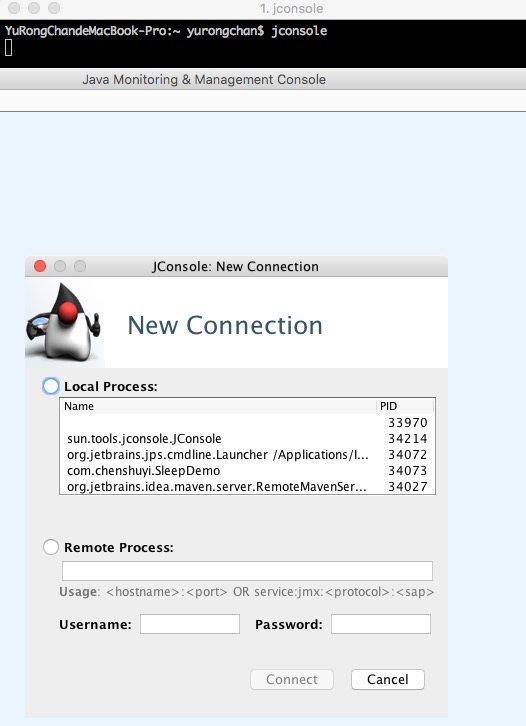
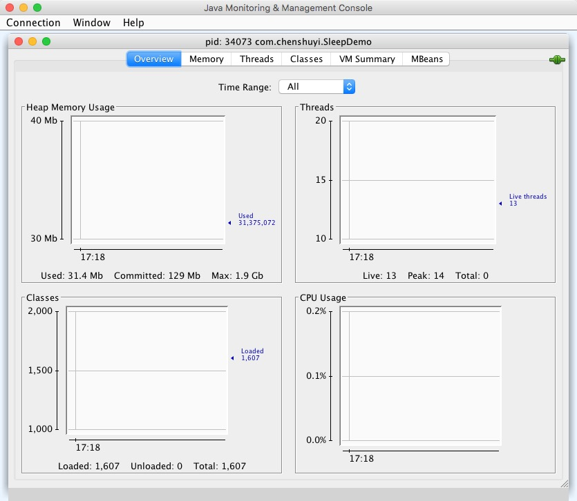
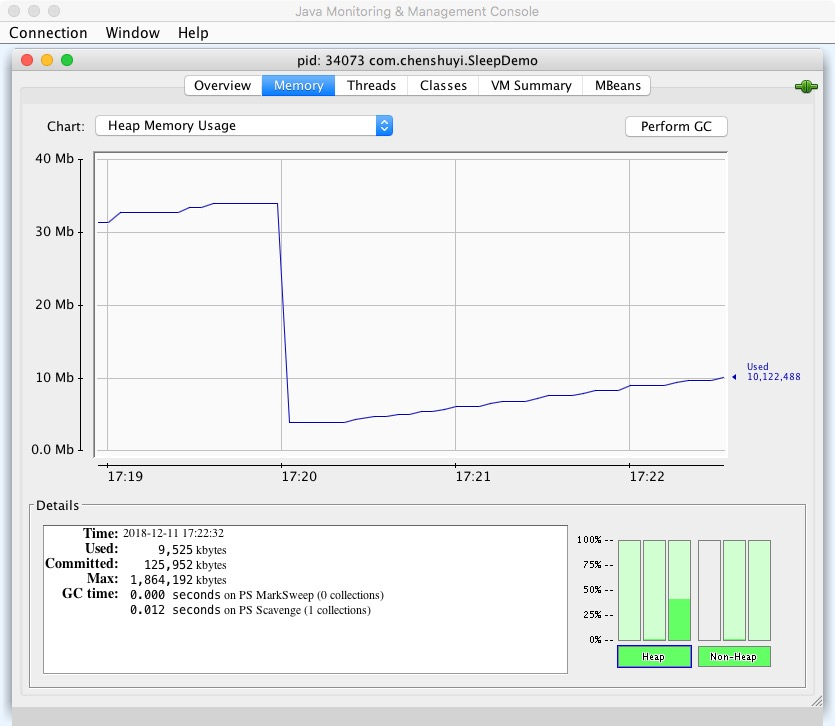
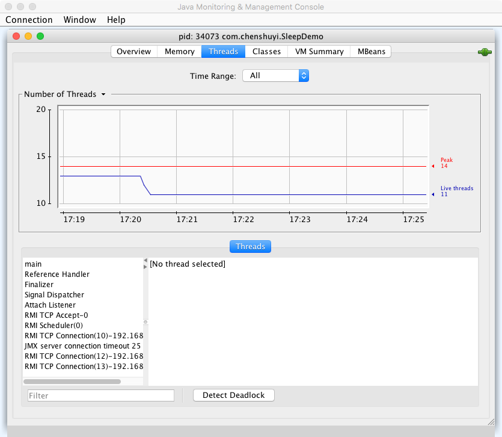
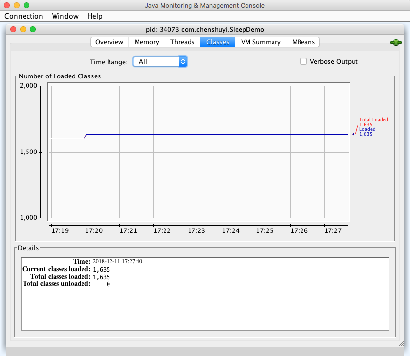
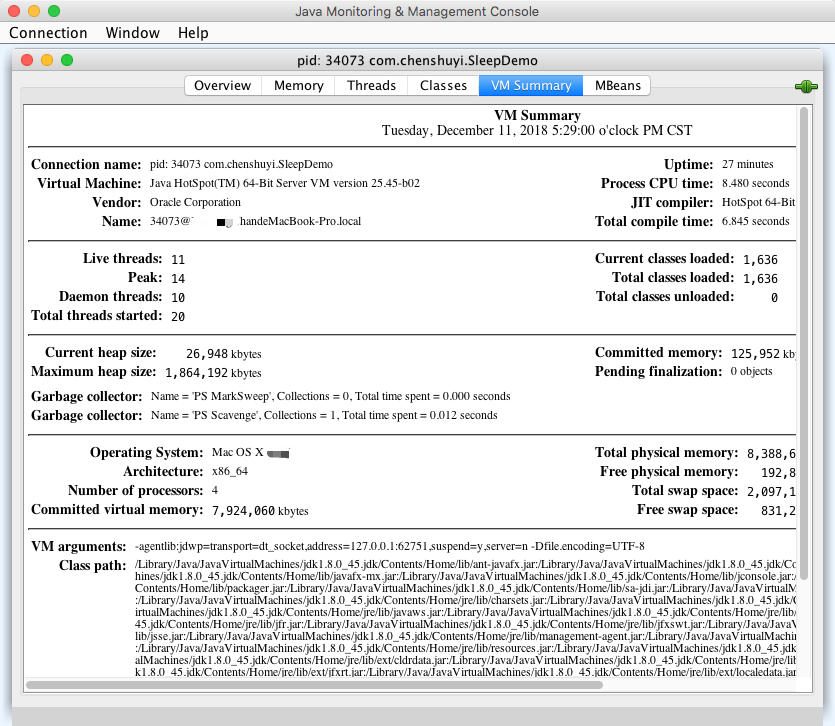
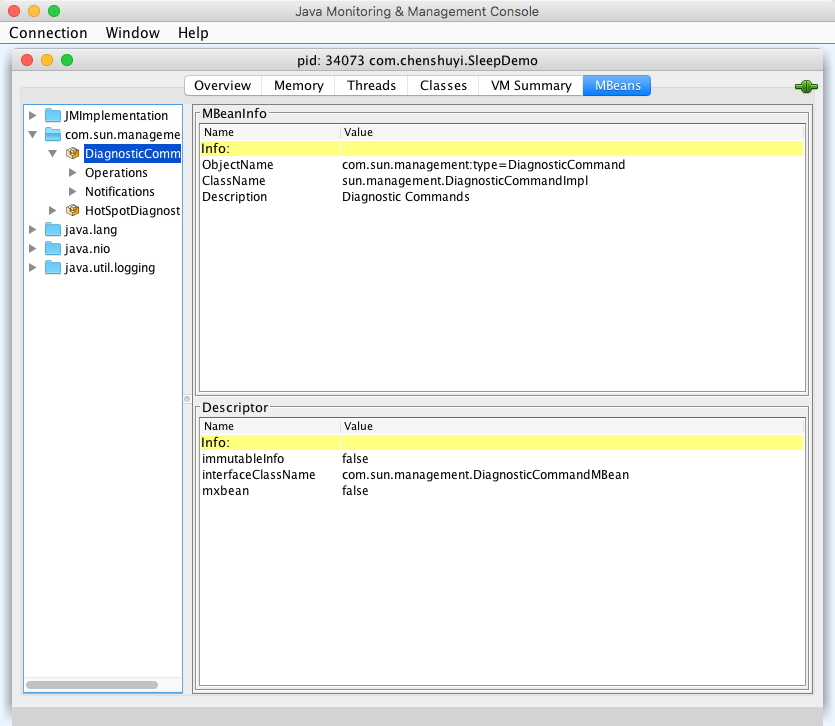

# JVM实战系列第2讲：图形化监控工具JConsole 

JConsole是JDK自带的图形化性能监控工具，通过JConsole可以查看Java应用的运行概况，可以监控堆信息、永久区使用情况、类加载情况等。

## 如何使用JConsole

直接从命令行启动，使JDK在PATH上，运行jconsole即可。

打开之后可以直接看到本机运行中的Java进程，你也可以连接到远程JVM进程上。这里我们直接进入`com.chenshuyi.SleepDemo`这个例子。

从上图可以看到有6个主要的标签页：Overview、Memory、Threads、Classes、VM Summary、MBeans。

### Overview 概况

显示堆内存、线程、类文件、CPU的使用情况，以图表形式展现出来，并且可以根据时间范围筛选。

### Memory 内存信息

显示内存的使用情况，可以查看不同区域（年轻代、老年代、永久代等）的内存情况，还可以手动点击右上角「Perform GC」按钮触发GC。

### Threads 线程信息

查看线程信息，同样可以根据时间范围进行筛选。

### Classes 类信息

查看类加载情况，同样可以根据时间范围进行筛选。

### VM Summary 虚拟机概况

查看虚拟机的概况，包括机器信息、堆信息等。

### MBeans

MBean是JDK中用来监控的一种方式，通过注册MBean可以监控虚拟机的运行情况，我们的JConsole工具之所以能够查看到堆栈的信息，本质上也是通过这种方式获取信息的。

## 总结

虽然JConsole功能也不错，但是在实际工作中，通常都不使用JConsole进行分析，而是使用后面讲到的VisualVM、MAT工具。

## 参考资料

* [用 JConsole观察分析Java程序的运行，进行排错调优](https://jiajun.iteye.com/blog/810150)
* [JVM监测分析JConsole](https://www.jianshu.com/p/290489f0a495)
* [jconsole工具使用](https://www.cnblogs.com/kongzhongqijing/articles/3621441.html)